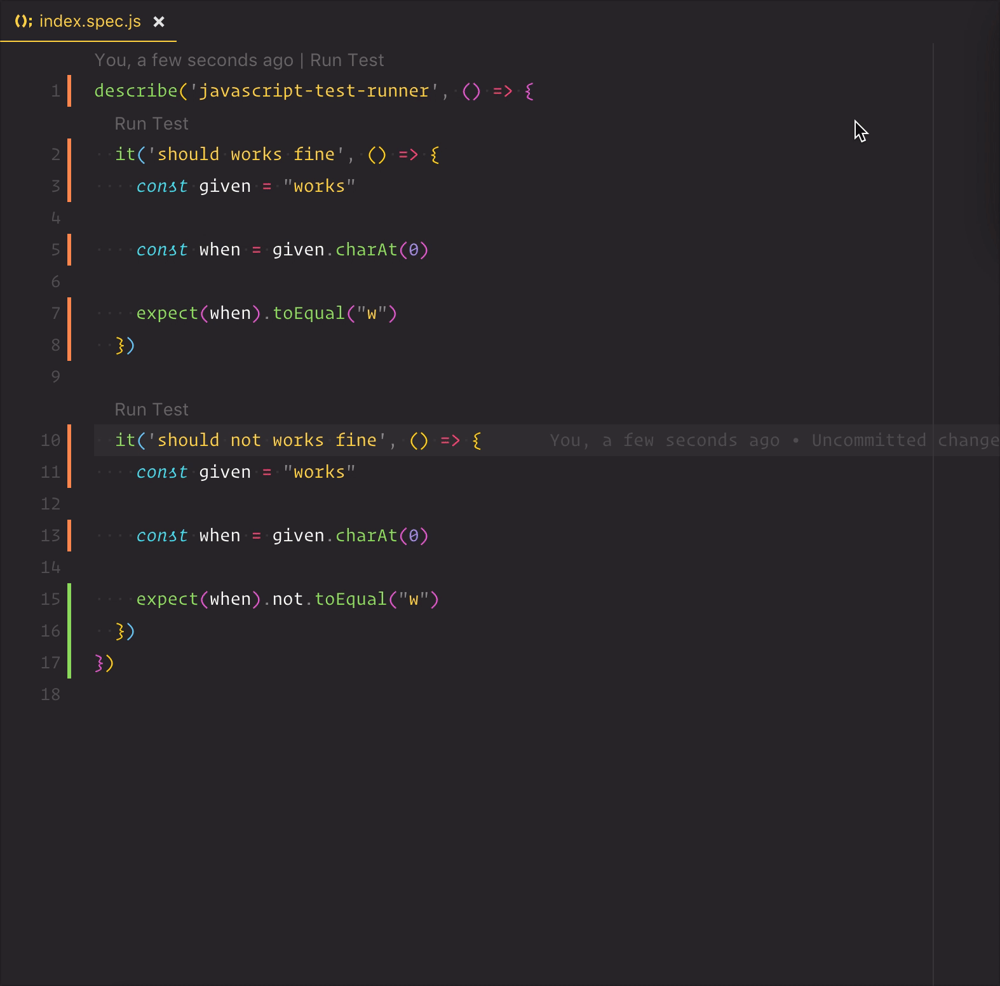

  

# Testify

Testify is an [open-source](https://github.com/felixjb/testify 'Open Testify on GitHub') extension for [Visual Studio Code](https://code.visualstudio.com 'Learn more about VSCode').

Testify **enables** you to run or debug JavaScript tests **individually** or **entire suites** with a **single click** through **code lens**. It adds code lens near any compatible test framework **keywords** and outputs the results to the **integrated terminal**.

If you need any information, try using our **ever-expanding** [Wiki](https://github.com/felixjb/testify/wiki). Or, if you have any **questions** or need any **help**, **join us** in the [Discussions](https://github.com/felixjb/testify/discussions).

## Compatibility

Testify maintainers are **always** working to support **more** frameworks as **best** as possible. Testify currently works with these test frameworks:

- [Jest](https://jestjs.io/)
- [Vitest](https://vitest.dev/)
- [Mocha](https://mochajs.org/)
- [Node.js](https://nodejs.org/api/test.html)
- [Playwright](https://playwright.dev/)
- [AVA](https://github.com/avajs/ava)

## Demo

## Configuration

You can configure Testify to work a little more to your taste using VSCode's settings. Here are all the configuration properties are available:

> [!IMPORTANT]
> When configuring `testify.testRunnerPath` for the Node.js Test Runner, you **must** provide the **absolute path** to the test runner executable on your system.
>
> - On Unix/Linux/macOS, run `which node` in your terminal to get the absolute path.
> - On Windows, run `where node` in Command Prompt.

| Property                     | Description                                                                                                                                                                                                                                                                                                                                                                                                                | Example                                                                                      | Default                                                                                                                                 |
| ---------------------------- | -------------------------------------------------------------------------------------------------------------------------------------------------------------------------------------------------------------------------------------------------------------------------------------------------------------------------------------------------------------------------------------------------------------------------- | -------------------------------------------------------------------------------------------- | --------------------------------------------------------------------------------------------------------------------------------------- |
| `testify.executablePath`     | The relative path (from the workspace folder) to the test runner executable. Used for running and watching tests in the terminal.  - Leave empty to auto-detect supported test runners. - If this is set, `testify.entryPointPath` **MUST** be set as well. - For Node.js Test Runner, this **MUST** be an absolute path. - Prefer forward slashes (`/`) for cross-platform compatibility.                  | `"node_modules/.bin/mocha"`                                                                  | `""`                                                                                                                                    |
| `testify.entryPointPath`     | The relative path (from the workspace root) to the test runner's JavaScript entry point. Used as the program for the VSCode debugger.  - Leave empty to auto-detect for supported test runners. - If this is set, `testify.executablePath` _should_ be set as well, otherwise it will not take effect. - Not used for Node.js Test Runner. - Prefer forward slashes (`/`) for cross-platform compatibility. | `"node_modules/mocha/bin/mocha.js"`                                                          | `""`                                                                                                                                    |
| `testify.args`               | An array of strings with command line arguments passed to the test runner.  - Each item is a separate argument (key and value). - Make sure to quote arguments properly where needed.                                                                                                                                                                                                                             | `["--require ts-node/register", "--no-timeout"]`                                             | `[]`                                                                                                                                    |
| `testify.debugConfiguration` | An object of the same type used in `.vscode/launch.json` - [read more](https://code.visualstudio.com/docs/debugtest/debugging-configuration) - to be used by the debugger with the test runner.  - Only one object is allowed, not an array.                                                                                                                                                                         | [VSCode documentation](https://code.visualstudio.com/docs/debugtest/debugging-configuration) | [Source File](https://github.com/felixjb/testify/blob/1ee3871cba92cb8b639d03e4572fcd898d7d2912/src/providers/configuration-provider.ts) |
| `testify.env`                | Environment variables to set when running or debugging tests. Specify as key-value pairs.                                                                                                                                                                                                                                                                                                                                  | `{ "NODE_ENV": "development" }`                                                              | `{}`                                                                                                                                    |
| `testify.skipFiles`          | An array of file or folder names, or path globs, to skip when debugging. Star patterns and negations are allowed                                                                                                                                                                                                                                                                                                           | `["<node_internals>/**"]`                                                                    | `[]`                                                                                                                                    |
| `testify.excludeFiles`       | An array of file or folder names, or path globs, to be excluded from test discovery. Star patterns and negations are allowed                                                                                                                                                                                                                                                                                               | `["**/*.cy.ts"]`                                                                             | `[]`                                                                                                                                    |
| `testify.autoClear`          | Whether to clear the terminal before running each test                                                                                                                                                                                                                                                                                                                                                                     | `true`                                                                                       | `true`                                                                                                                                  |

<!-- You can use this tool to generate a markdown table: https://www.tablesgenerator.com/markdown_tables# -->

## Versioning

We use [Semantic Versioning](https://semver.org/spec/v2.0.0.html) for versioning. For the versions available, see the [tags on this repository](https://github.com/felixjb/testify/tags).
Also, this project adheres to [Keep a Changelog](http://keepachangelog.com/).

## Contributing

Please read the [CONTRIBUTING](https://github.com/felixjb/testify/blob/main/CONTRIBUTING.md), and, specially, the [CODE OF CONDUCT](https://github.com/felixjb/testify/blob/main/CODE_OF_CONDUCT.md) documents.

Thanks goes to these wonderful people ([emoji key](https://github.com/kentcdodds/all-contributors#emoji-key)):

<!-- ALL-CONTRIBUTORS-LIST:START - Do not remove or modify this section -->
<!-- prettier-ignore-start -->
<!-- markdownlint-disable -->
<table>
  <tbody>
    <tr>
      <td align="center" valign="top" width="14.28%"><a href="https://github.com/felixjb"> <b>Felix J. Batista</b></a> <a href="https://github.com/felixjb/testify/commits?author=felixjb" title="Code">💻</a> <a href="#ideas-felixjb" title="Ideas, Planning, & Feedback">🤔</a></td>
      <td align="center" valign="top" width="14.28%"><a href="https://github.com/silvawillian"> <b>Willian Silva</b></a> <a href="https://github.com/felixjb/testify/commits?author=silvawillian" title="Code">💻</a></td>
      <td align="center" valign="top" width="14.28%"><a href="https://github.com/g3offrey"> <b>Geoffrey</b></a> <a href="https://github.com/felixjb/testify/commits?author=g3offrey" title="Code">💻</a> <a href="#ideas-g3offrey" title="Ideas, Planning, & Feedback">🤔</a></td>
      <td align="center" valign="top" width="14.28%"><a href="https://github.com/ooga"> <b>Johan Rouve</b></a> <a href="https://github.com/felixjb/testify/issues?q=author%3Aooga" title="Bug reports">🐛</a> <a href="https://github.com/felixjb/testify/commits?author=ooga" title="Code">💻</a></td>
      <td align="center" valign="top" width="14.28%"><a href="https://github.com/nkreshchenko"> <b>Kreshchenko Nickolay</b></a> <a href="https://github.com/felixjb/testify/commits?author=nkreshchenko" title="Code">💻</a> <a href="#ideas-nkreshchenko" title="Ideas, Planning, & Feedback">🤔</a></td>
      <td align="center" valign="top" width="14.28%"><a href="https://github.com/roggenbrot"> <b>Sascha Dais</b></a> <a href="https://github.com/felixjb/testify/issues?q=author%3Aroggenbrot" title="Bug reports">🐛</a> <a href="https://github.com/felixjb/testify/commits?author=roggenbrot" title="Code">💻</a> <a href="#ideas-roggenbrot" title="Ideas, Planning, & Feedback">🤔</a></td>
      <td align="center" valign="top" width="14.28%"><a href="https://github.com/LoveSponge"> <b>Guy</b></a> <a href="https://github.com/felixjb/testify/commits?author=LoveSponge" title="Code">💻</a></td>
    </tr>
    <tr>
      <td align="center" valign="top" width="14.28%"><a href="https://github.com/calebboyd"> <b>Caleb Boyd</b></a> <a href="https://github.com/felixjb/testify/issues?q=author%3Acalebboyd" title="Bug reports">🐛</a> <a href="https://github.com/felixjb/testify/commits?author=calebboyd" title="Code">💻</a> <a href="#maintenance-calebboyd" title="Maintenance">🚧</a></td>
      <td align="center" valign="top" width="14.28%"><a href="http://felipecrs.com"> <b>Felipe Santos</b></a> <a href="#infra-felipecrs" title="Infrastructure (Hosting, Build-Tools, etc)">🚇</a></td>
      <td align="center" valign="top" width="14.28%"><a href="https://github.com/Beleren"> <b>Leandro Haruki</b></a> <a href="https://github.com/felixjb/testify/commits?author=Beleren" title="Code">💻</a></td>
      <td align="center" valign="top" width="14.28%"><a href="https://www.linkedin.com/in/barbara-iamauchi-772732121/"> <b>Barbara Iamauchi</b></a> <a href="#design" title="Design">🎨</a></td>
      <td align="center" valign="top" width="14.28%"><a href="http://bartoszputek.com"> <b>Bartosz Putek</b></a> <a href="https://github.com/felixjb/testify/issues?q=author%3Abartoszputek" title="Bug reports">🐛</a> <a href="https://github.com/felixjb/testify/commits?author=bartoszputek" title="Code">💻</a></td>
    </tr>
  </tbody>
</table>

<!-- markdownlint-restore -->
<!-- prettier-ignore-end -->

<!-- ALL-CONTRIBUTORS-LIST:END -->

This project follows the [all-contributors](https://github.com/kentcdodds/all-contributors) specification. Contributions of any kind welcome!

## Authors

- **Geoffrey** - _Initial work_ - Github: [@g3offrey](https://github.com/g3offrey)
- **Felix J. Batista** - _Forked project_ - Github: [@felixjb](https://github.com/felixjb)

based on [JavaScript Test Runner](https://github.com/g3offrey/javascript-test-runner) by **Geoffrey**

## License

This project is licensed under the MIT License - see the [LICENSE](https://github.com/felixjb/testify/blob/main/LICENSE) file for details.
